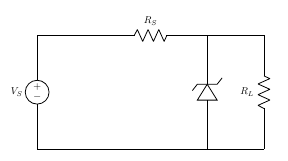
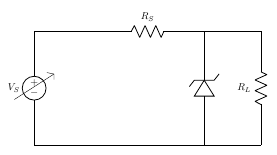
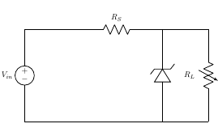

## Assignment

1. The circuit shown uses a 9.0V zener diode. If the load resistance RL is equal to 1.5 kΩ, and the DC source equals 24V, find the maximum value of resistor RS required to maintain a constant voltage of 9V across the load.
&nbsp; &nbsp; &nbsp; &nbsp; &nbsp; &nbsp;[Ans:RS =2.5 KΩ ]

Figure 5  

2. Determine the range of (VS) for obtaining a regulated voltage shown in Fig.6 for the data
0≤(IL)≤4mA
2≤IZ≤8mA
[Where Z=50V,(RS)=5KΩ]
&nbsp; &nbsp; &nbsp; &nbsp; &nbsp; &nbsp;[Ans:The range of source voltage is 50 ≤ (VS) ≤ 110 V]

Figure 6  

3. Determine the RLmin, where RS=1KΩ ,Vin=50V, VZ=10V

&nbsp; &nbsp; &nbsp; &nbsp; &nbsp; &nbsp;
[Ans:RLmin=300Ω ]

Figure 7  

4. Determine the IL and IZ, where RS=160KΩ ,Vin=24V, VZ=12V,
200≤RL≤∞
&nbsp; &nbsp; &nbsp; &nbsp; &nbsp; &nbsp;
[Ans: 0 ≤ IL ≤ 60 mA & 75 ≥ IZ ≥ 15mA]

Figure 8  

5. Determine the IS and IZ,where RS=5KΩ , VZ=50V, RL=10KΩ
80≤VS≤120
&nbsp; &nbsp; &nbsp; &nbsp; &nbsp; &nbsp;
[Ans: 6mA ≤ IS ≤ 14 mA & 1mA ≥ IZ ≥ 9mA]

Figure 9  

