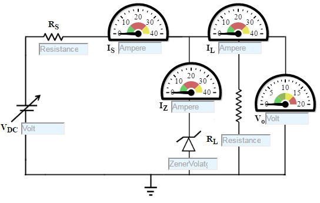
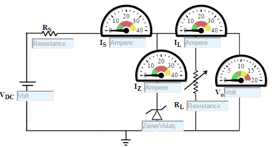
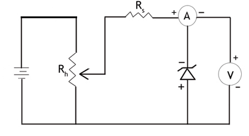

### Procedure

### Zener Diode - Line Regulation
1. Set the Zener Voltage(VZ)
2. Set the  Series Resistance (RS) value.
3. Set the Load Resistance (RL) value.
4. Vary DC voltage.
5. Voltmeter is placed parallel to load resistor and ammeter series with the series resistor.
6. Choose appropriate DC voltage such that zener diode is 'on'.
7. Now note the Voltmeter and Ammeter reading for various DC voltage.
8. Note the Load current(IL), zener current(IZ), Output voltage(VO)
9. Calculate the voltage regulation.
                                    

Figure:1

### Zener Diode - Load Regulation
1. Set DC voltage.
2. Set the Series Resistance (RS) value.
3. 1W D0-41 Glass Zener Diode 1N4740A, Zener voltage is 10 V.
4. Vary the Load Resistance (RL).
5. Voltmeter is placed parallel to load resistor and ammeter series with the series resistor.
6. Choose Load Resistance in such a manner, such that the Zener diode is 'on'.
7. Now note the Voltmeter and Ammeter reading for various Load Resistance.
8. Increase the load resistance (RL).
9. Note the Load current (IL), zener current (IZ), Output voltage(VO)
10. Calculate the voltage regulation.

Figure: 2

### Zener Characteristics
1. Select the diode
2. Set the rheostat Rh=1 Ω
3. By adjusting the rheostat, voltmeter reading is increased from 0 and in each time note the corresponding reading in milliammeter.
4. Take the readings and note Voltmeter reading across Zener diode and Ammeter reading.
5. Plot the V-I graph and observe the change.

Figure: 3

