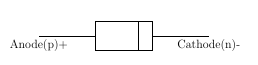
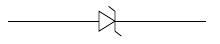
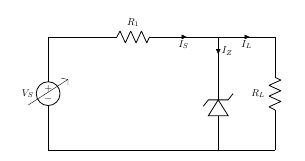
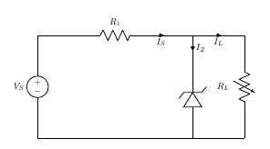
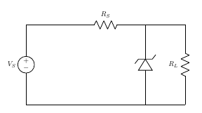
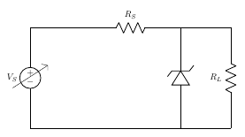
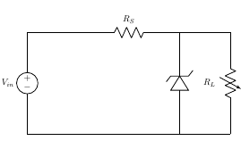

# Theory

### Zener Diode

A Zener Diode is a special kind of diode which permits current to flow in the forward direction as normal, but will also allow it to flow in the reverse direction when the voltage is above the breakdown voltage or ‘zener’ voltage. Zener diodes are designed so that their breakdown voltage is much lower - for example just 2.4 Volts.

Figure 1  

Figure 2  

### Function of Zener Diode

1. Zener diodes are a special kind of diode which permits current to flow in the forward direction.
2. Zener diodes will also allow current to flow in the reverse direction when the voltage is above a certain value. This breakdown voltage is known as the Zener voltage. In a standard diode, the Zener voltage is high, and the diode is permanently damaged if a reverse current above that value is allowed to pass through it.
3. In the reverse bias direction, there is practically no reverse current flow until the breakdown voltage is reached. When this occurs there is a sharp increase in reverse current. Varying amount of reverse current can pass through the diode without damaging it. The breakdown voltage or zener voltage (VZ) across the diode remains relatively constant.

### Zener Diode As A Voltage Regulator

A voltage regulator is an electronic circuit that provides a stable DC voltage independent of the load current, temperature and AC line voltage variations. A Zener diode of break down voltage VZ is reverse connected to an input voltage source VI across a load resistance RL and a series resistor RS. The voltage across the zener will remain steady at its break down voltage VZ for all the values of zener current IZ  as long as the current remains in the break down region. Hence a regulated DC output voltage V0=VZ is obtained across RL, whenever the input voltage remains within a minimum and maximum voltage. Basically there are two type of regulations such as:
**Line Regulation:** In this type of regulation, series resistance and load resistance are fixed, only input voltage is changing. Output voltage remains the same as long as the input voltage is maintained above a minimum value.
**Load Regulation:** In this type of regulation, input voltage is fixed and the load resistance is varying. Output volt remains same, as long as the load resistance is maintained above a minimum value.

### Line Regulation 

Figure 3  

In Line Regulation, Load resistance is constant and input voltage varies. VI must be sufficiently large to turn the Zener Diode ON.

$$V_L = V_Z= \frac{V_{Imin} \times R_L}{(R_S + R_L)}$$

So, the minimum turn-on voltage VImin is :

$$V_{Imin}= \frac{V_Z \times (R_S + R_L)}{R_L}$$
                            
 The maximum value of VI is limited by the maximum zener current IZmax
 
 $$I_{Rmax}= I_{Zmax} + I_L $$              

IL is fixed at :   
$$\frac{V_Z}{R_L}$$  
Since, VL=VZ 

So maximum VI is   
$$V_{Imax} =  V_{Rmax} + V_Z$$
$$V_{Imax} = I_{Rmax} \times R + V_Z$$
For VI  < VZ
$$V_O= V_I$$
For VI > VZ 
$$V_O = V_I − I_S \times R_S$$

### Load Rotation

Figure 4  

In Load Regulation , input voltage is constant and Load resistance varies. Too small a Load Resistance RL,will result in VTh < VZ and Zener Diode will be OFF.

$$V_L = V_Z = \frac{V_{Imin} \times R_L}{(R_S + R_L)}$$

So the minimum load resistance RL 

$$R_{Lmin} = \frac{V_Z  \times R_S}{V_I− V_Z}$$

Any load resistance greater than RLmin will make Zener Diode ON   

$$I_S  = I_L + I_Z$$

RLmin will establish maximum IL as   

$$I_{Lmax}=\frac{V_L}{R_{Lmin}}= \frac{V_Z}{R_{Lmin}} \qquad Since, V_L=V_Z$$

VS is the voltage drop across RS

$$V_S = V_{Imin} - V_Z$$

$$I_S = \frac{V_{Imin}− V_Z}{R_S}$$

For RL < RLmin

$$V_O= V_I$$

For RL > RLmin

$$V_O = V_I − I_S \times R_S$$

## Assignment

1. The circuit shown uses a 9.0V zener diode. If the load resistance RL is equal to 1.5 kΩ, and the DC source equals 24V, find the maximum value of resistor RS required to maintain a constant voltage of 9V across the load.
&nbsp; &nbsp; &nbsp; &nbsp; &nbsp; &nbsp;[Ans:RS =2.5 KΩ ]

Figure 5  

2. Determine the range of (VS) for obtaining a regulated voltage shown in Fig.6 for the data
0≤(IL)≤4mA
2≤IZ≤8mA
[Where Z=50V,(RS)=5KΩ]
&nbsp; &nbsp; &nbsp; &nbsp; &nbsp; &nbsp;[Ans:The range of source voltage is 50 ≤ (VS) ≤ 110 V]

Figure 6  

3. Determine the RLmin, where RS=1KΩ ,Vin=50V, VZ=10V

&nbsp; &nbsp; &nbsp; &nbsp; &nbsp; &nbsp;
[Ans:RLmin=300Ω ]

Figure 7  

4. Determine the IL and IZ, where RS=160KΩ ,Vin=24V, VZ=12V,
200≤RL≤∞
&nbsp; &nbsp; &nbsp; &nbsp; &nbsp; &nbsp;
[Ans: 0 ≤ IL ≤ 60 mA & 75 ≥ IZ ≥ 15mA]

Figure 8  

5. Determine the IS and IZ,where RS=5KΩ , VZ=50V, RL=10KΩ
80≤VS≤120
&nbsp; &nbsp; &nbsp; &nbsp; &nbsp; &nbsp;
[Ans: 6mA ≤ IS ≤ 14 mA & 1mA ≥ IZ ≥ 9mA]

Figure 9  

